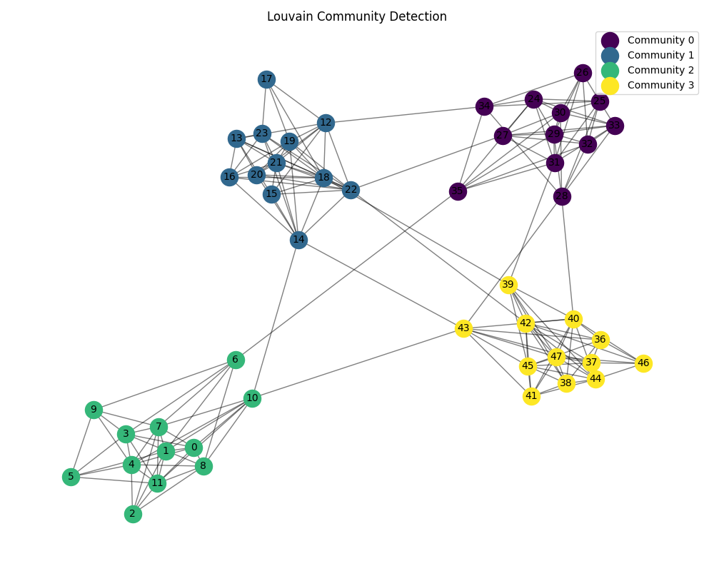

# Chuỗi Bài Tutorial: Lý Thuyết Đồ Thị và Phát Hiện Cộng Đồng

## Giới Thiệu

Lý thuyết đồ thị là nền tảng quan trọng trong toán học rời rạc và khoa học máy tính, với nhiều ứng dụng trong thực tế như mạng xã hội, giao thông vận tải, sinh học, và nhiều lĩnh vực khác. Chuỗi bài này trình bày các khái niệm cơ bản và các thuật toán phát hiện cộng đồng (community detection) trên đồ thị một cách toàn diện và dễ hiểu.

## Nội Dung

### Phần 1: Cơ Bản Về Đồ Thị
1. **[Giới thiệu về đồ thị](graph_basics.md)**: Định nghĩa, biểu diễn và các loại đồ thị
2. **[Các thuật toán duyệt đồ thị](graph_traversal.md)**: BFS, DFS và ứng dụng
3. **[Đường đi và kết nối](paths_and_connectivity.md)**: Đường đi ngắn nhất, các thành phần liên thông

### Phần 2: Phát Hiện Cộng Đồng
1. **[Connected Components](connected_components.md)**: Thuật toán cơ bản để xác định các thành phần liên thông
2. **[Label Propagation](label_propagation.md)**: Phát hiện cộng đồng bằng cách lan truyền nhãn
3. **[Thuật toán Louvain](louvain.md)**: Phát hiện cộng đồng bằng tối ưu hóa modularity
4. **[Walktrap](walktrap.md)**: Phát hiện cộng đồng dựa trên random walks

### Phần 3: Ứng Dụng và Thực Hành
1. **[Phân tích mạng xã hội](social_network_analysis.md)**: Ứng dụng trong phân tích cộng đồng mạng xã hội
2. **[Thực hành với NetworkX](networkx_tutorial.md)**: Triển khai các thuật toán phát hiện cộng đồng

## Yêu Cầu Kiến Thức

- Kiến thức cơ bản về Python
- Hiểu biết cơ bản về toán rời rạc

## Cách Sử Dụng Chuỗi Bài

Học viên nên bắt đầu từ phần Cơ Bản Về Đồ Thị và làm theo thứ tự. Mỗi bài đều có các ví dụ minh họa và mã nguồn để thực hành. Các công thức toán học được giải thích chi tiết với các bước tính toán cụ thể.

## Tài Nguyên Bổ Sung

- Sách: "Networks, Crowds, and Markets: Reasoning About a Highly Connected World" - David Easley, Jon Kleinberg
- Thư viện: NetworkX, igraph, graph-tool
- Khóa học: Social Network Analysis trên Coursera

---

**Chú ý**: Chuỗi bài đang được phát triển và cập nhật liên tục. Vui lòng kiểm tra phiên bản mới nhất.